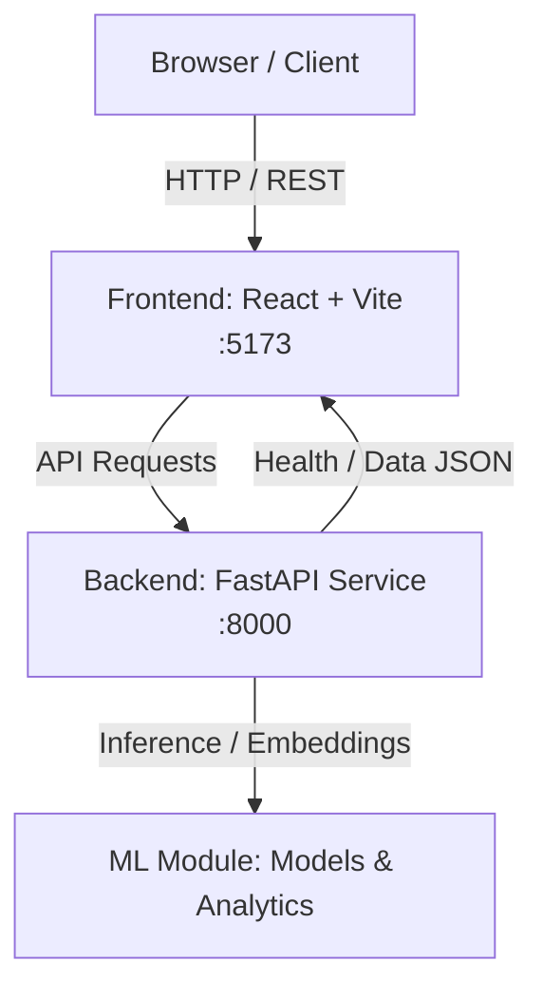

# WorkLink System Architecture

Welcome to the **WorkLink** monorepo architecture documentation. WorkLink is designed as an intelligent, high-performance platform structured around decoupled service modules.

## Architecture Overview

WorkLink uses a micro-service/monorepo pattern with four primary directories:

```
workk/
├── frontend/   # React 19 + TypeScript + Vite web user interface
├── backend/    # FastAPI Python web server & API gateway
├── ml/         # Machine learning models, pipelines, and inference scripts
└── docs/       # Architecture diagrams, specifications, and project documentation
```

### High-Level System Architecture Diagram



---

## Service Breakdown

### 1. Frontend (`frontend/`)
- **Framework:** React 19 with TypeScript
- **Build Tool:** Vite
- **Styling:** Modern CSS custom design tokens, glassmorphism, dynamic responsive layout, Dark Mode palette
- **Iconography:** Lucide Icons
- **Key Responsibilities:**
  - Dynamic visual user interface
  - Real-time connection status monitoring to backend endpoints
  - Modular component structure ready for future features

### 2. Backend (`backend/`)
- **Framework:** FastAPI (Python 3.13+)
- **Server:** Uvicorn (ASGI)
- **Validation:** Pydantic v2
- **Key Responsibilities:**
  - Core API Gateway
  - Exposure of system health check (`GET /health`)
  - Cross-Origin Resource Sharing (CORS) configured for frontend communication
  - Base for future authentication, workflow, and data persistence services

### 3. Machine Learning Module (`ml/`)
- **Environment:** Python
- **Key Responsibilities:**
  - Predictive modeling, classification algorithms, and feature engineering
  - Model evaluation, training scripts, and serialized model storage
  - Integration with backend for AI-driven workload optimization

### 4. Documentation (`docs/`)
- Contains detailed system design documents, API specifications, and architectural guidelines.

---

## Health Check API Contract

### `GET /health`
- **Method:** `GET`
- **Endpoint:** `/health`
- **Response Format:** `application/json`
- **Response Example:**
  ```json
  {
    "status": "healthy",
    "service": "WorkLink Backend API",
    "version": "0.1.0",
    "timestamp": "2026-10-07T07:14:00Z"
  }
  ```
